# Public Speaking Improvement Assistant

This application represents the work for my [bachelor's thesis](https://github.com/TunsAdrian/Public-Speaking-Improvement-Assistant/blob/master/documentation/thesis.pdf), application called Public Speaking Improvement Assistant.

This is a mobile application created with the purpose of improving one's ability to hold a speech, by rehearsing it and
getting useful insights after finishing the rehearsal.
As the user speaks, text-to-speech conversion of the speech is performed (which can be done in several languages),
real-time analysis of the words is made, and a statistics page is generated at the end of the speech.
Filter words (and words that need to be taken out of the speech in general) can also be set, and they will appear
highlighted in the script.

The speech statistics together with the script can be saved locally, and even synced to cloud.
The user can create an account with either an email and a password, or with a Google account, which will be used in order to sync the saved speeches to
cloud, and to download them on another device.

The application was made with Flutter version 1.x, using Redux architecture, Firebase, and Google Cloud Speech-to-Text
API.

The "User’s Manual" 5.1.1 part of the [thesis](https://github.com/TunsAdrian/Public-Speaking-Improvement-Assistant/blob/master/documentation/thesis.pdf) contains additional information regarding how to run the project
locally.

### The setup for the speech rehearsal can be seen in the following images (filter words and language setup):

<table>
  <tr>
    <td>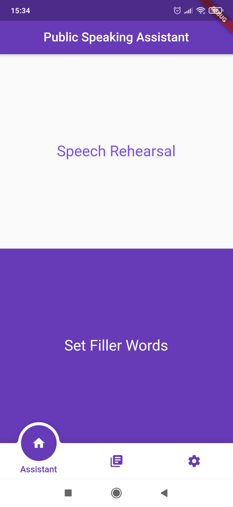</td>
    <td>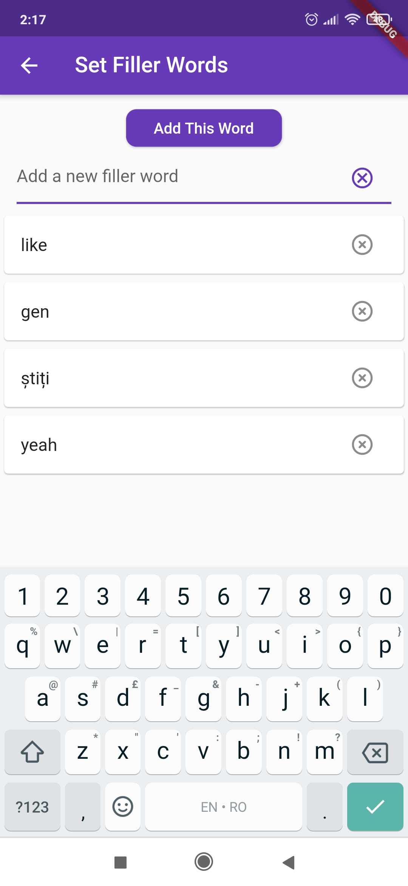</td>
    <td>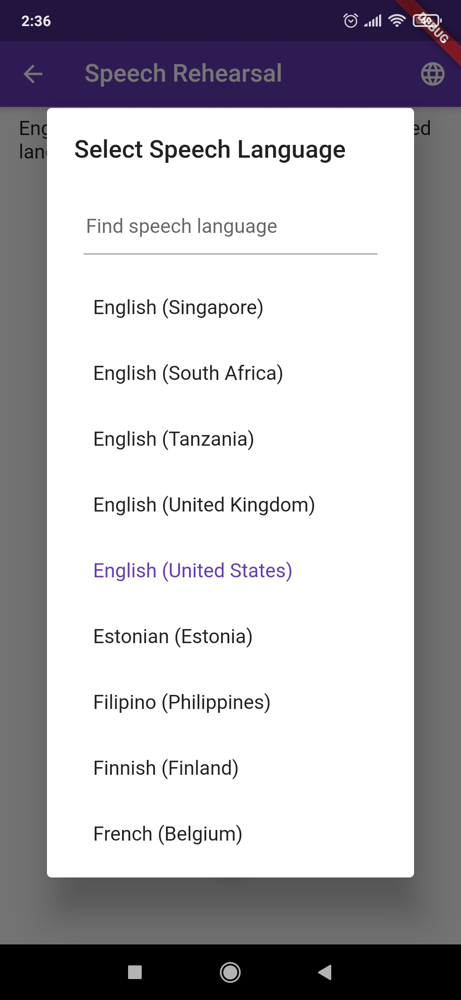</td>
  </tr>
 </table>

### The speech rehearsal flow can be observed in the following images:

<table>
  <tr>
    <td>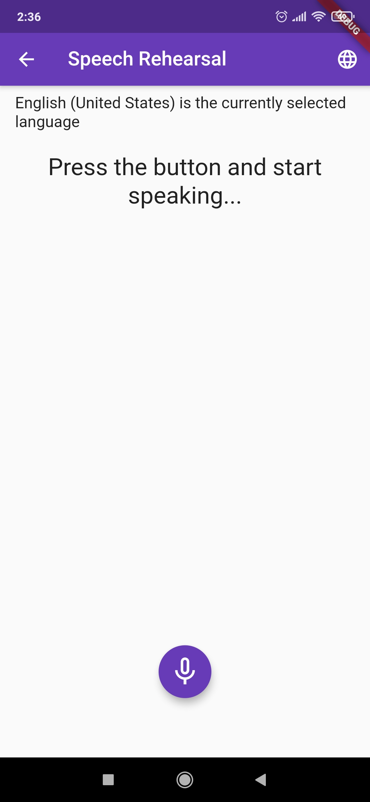</td>
    <td>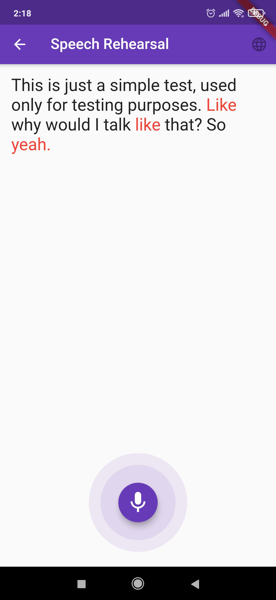</td>
    <td>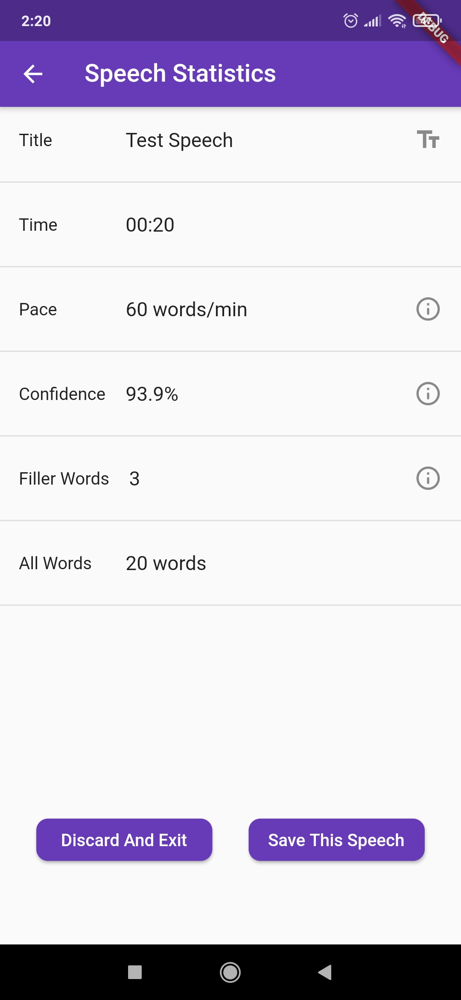</td>
  </tr>
 </table>

### The library, the settings page and the sign-in page can be observed in the following images:

<table>
  <tr>
    <td>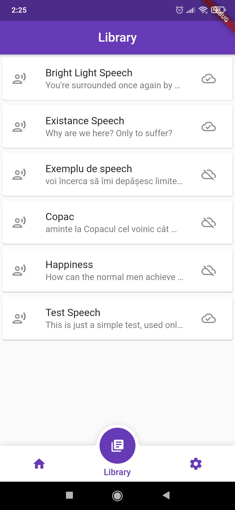</td>
    <td>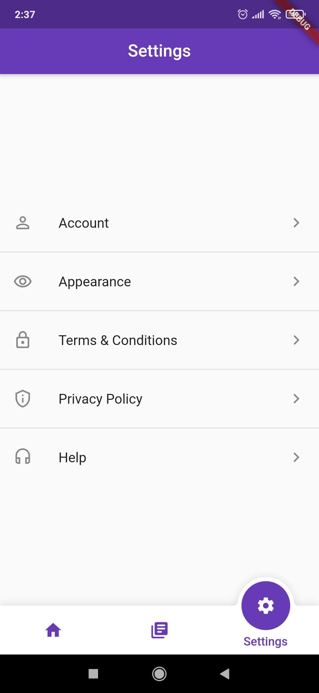</td>
    <td>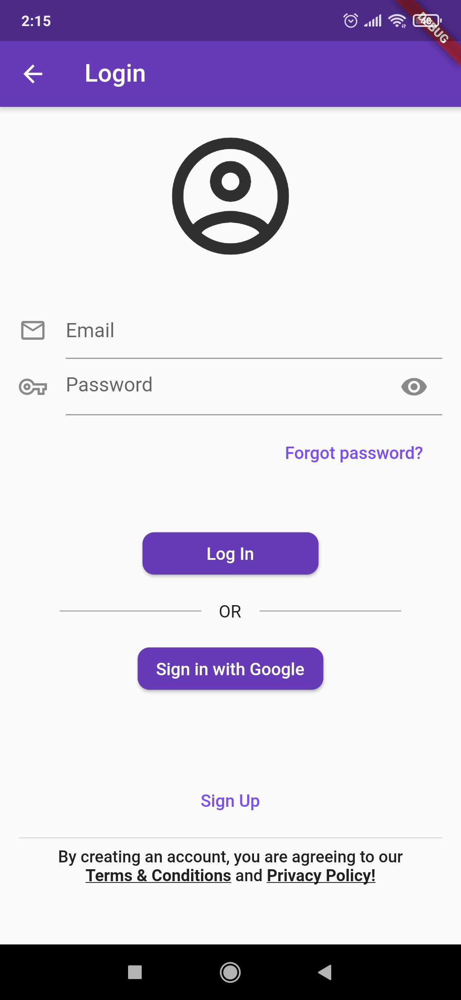</td>
  </tr>
 </table>

### The account and the appearance settings pages can be observed in the following images:

<table>
  <tr>
    <td>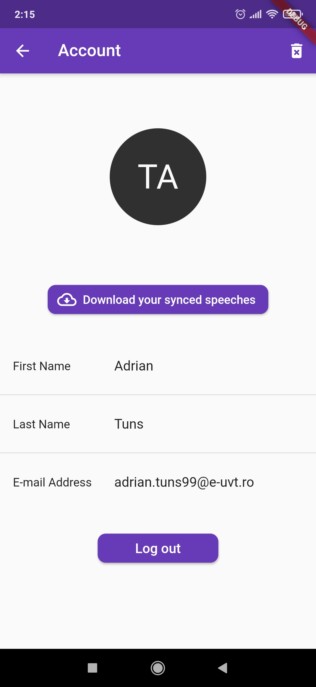</td>
    <td>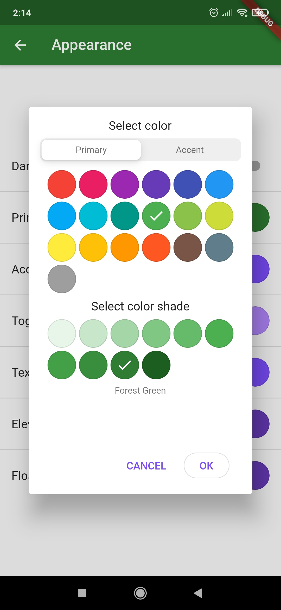</td>
    <td>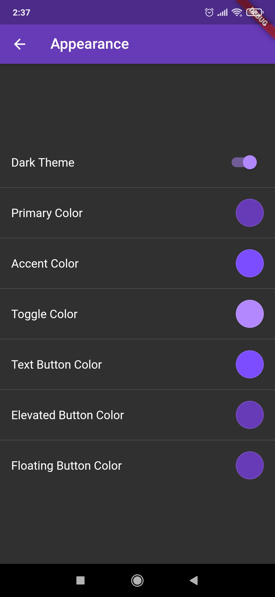</td>
  </tr>
 </table>
